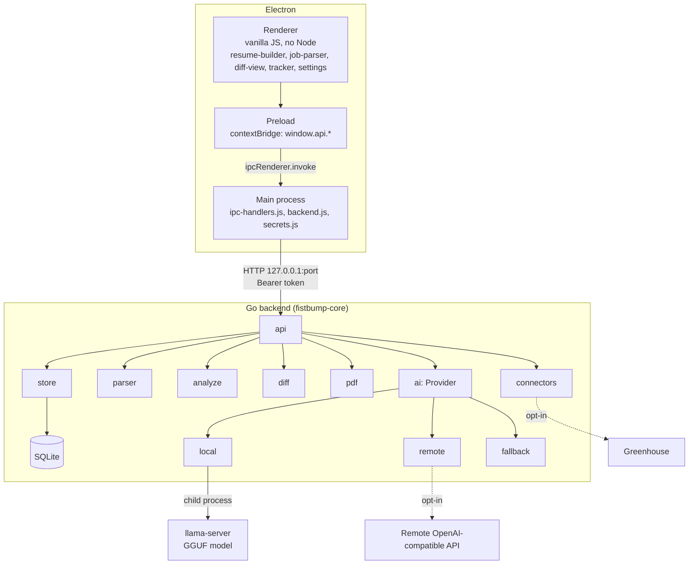
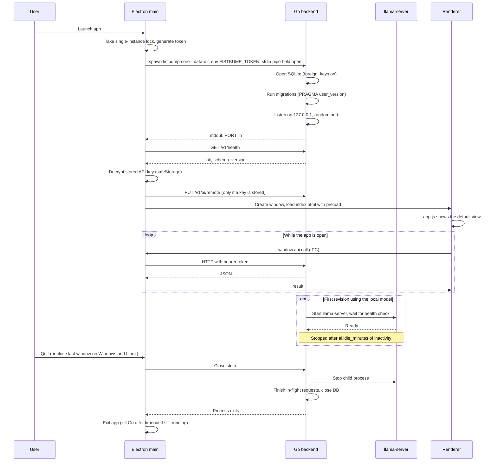
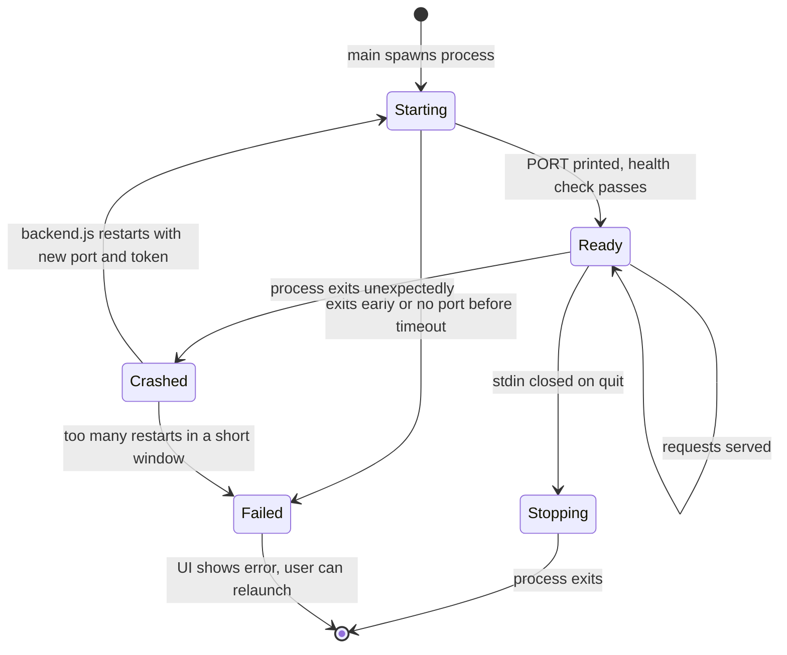
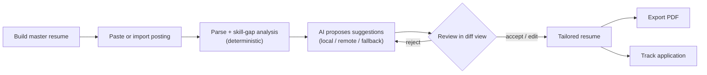
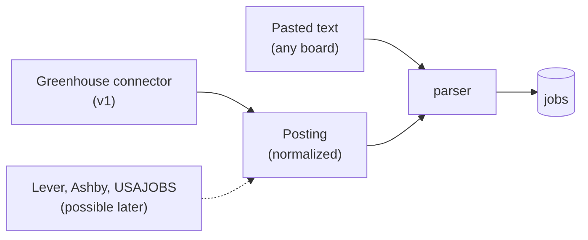
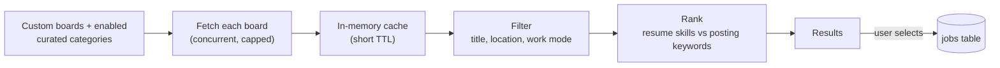
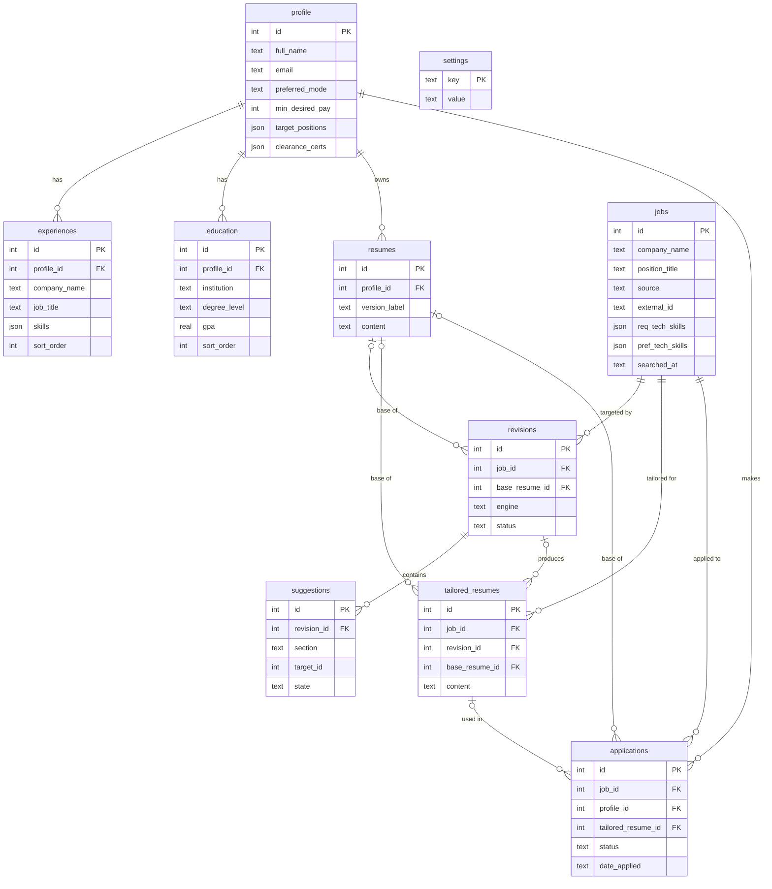
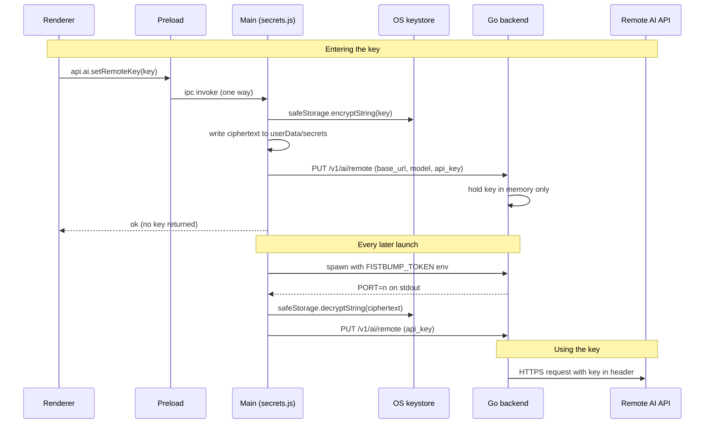

# FistBump Architecture

FistBump is a local-first desktop app. It stores a master resume, parses job postings, shows skill gaps, and generates resume revisions that the user reviews before exporting a PDF. Data stays on the user's machine unless a remote AI provider is configured.

## Goals and constraints

| ID | Constraint | Design consequence |
|----|------------|--------------------|
| NFR-1 | Data and inference stay local (or on user-supplied compute) | SQLite on disk; local `llama-server`; remote AI is opt-in with the user's own key |
| NFR-2 | Windows, macOS, Linux | Electron shell; pure-Go backend (no cgo) cross-compiled per OS/arch |
| NFR-3 | Skill-gap analysis under 1.5 s | Analysis is deterministic and never calls a model |
| NFR-4 | User controls final text | Every AI change is a suggestion with accept/reject/edit |
| NFR-5 | Install under 250 MB, excluding model weights | Models are downloaded on demand; cache cleanup and job GC |

## System overview



## App lifecycle

### Startup to shutdown



### Backend process states



### Notes

- **Startup order.** The window opens after the backend is healthy and the stored key is delivered. A startup failure shows an error screen with the stderr tail.
- **Single instance.** A lock prevents two apps from opening the same database.
- **Local model.** `llama-server` starts on the first local revision or test call and stops after `ai.idle_minutes` (default 5).
- **Background work.** Revision generation and model downloads run in the backend. The UI polls status routes.
- **Crash recovery.** `backend.js` restarts the backend with a new port and token and re-sends the API key. In-flight requests fail and the UI offers a retry. Repeated crashes stop the restarts and show an error.
- **Shutdown.** Closing stdin is the quit signal on every platform. It also covers Electron dying, since Go exits on stdin close. On macOS, closing the last window does not quit the app.
- **Timeouts.** Planned values: 10 s startup, 5 s shutdown. Tune after measuring.

## Electron app (`app/`)

- **Renderer** has no Node access. `js/app.js` is a view router; `js/api.js` wraps `window.api`.
- **Preload** exposes a small, named method set via `contextBridge` (for example `resume.get`). The renderer cannot reach `ipcRenderer`, the port, or the token.
- **Main process**
  - `backend.js` spawns the Go binary, reads the port from its stdout, attaches the bearer token to every request, and restarts it on crash.
  - `ipc-handlers.js` maps `ipcMain.handle('resume:get', ...)` style channels to backend calls. It also owns the native save dialog for PDF export.
  - `secrets.js` stores the remote API key with `safeStorage` and re-sends it to Go at launch, so the key is never written to the database.
  - `main.js` handles window creation and lifecycle, and kills the Go process on quit.

## Go backend (`backend/`)

A single module, `cmd/fistbump-core`, with everything under `internal/`. Every `foo.go` has an adjacent `foo_test.go` in the same package.

| Package | Responsibility |
|---------|----------------|
| `api` | HTTP server, routes under `/v1`, bearer-token middleware, panic recovery, JSON helpers |
| `db` | Opens SQLite (`modernc.org/sqlite`, pure Go) with foreign keys on; embedded migrations tracked via `PRAGMA user_version` |
| `store` | SQL CRUD, one file per table; settings key-value store; job GC by `searched_at` |
| `models` | Types shared across packages only |
| `parser` | Posting text cleanup, keyword and n-gram extraction |
| `analyze` | Deterministic skill-gap comparison of posting vs. master resume |
| `diff` | Bullet-level diff generation for the diff view |
| `ai` | Provider abstraction, model catalog and downloads (below) |
| `connectors` | Opt-in job imports behind one `FetchPostings(query)` interface; Greenhouse first |
| `pdf` | PDF export (gofpdf/maroto) |

### Process contract

- Flag `--data-dir` sets where the database and models live.
- Logs go to **stderr**. **stdout carries only the port line**, which Electron parses.
- Listens on `127.0.0.1` only, on a random port.
- Exits when stdin closes.
- Requests without the correct bearer token are rejected.

### AI layer

`Provider` is the interface the API layer calls. Implementations:

1. **local**: manages a `llama-server` child process (start, health check, idle stop) for on-device GGUF models.
2. **remote**: OpenAI-compatible client, covering hosted APIs and Ollama. Enabled when a key or endpoint is configured.
3. **fallback**: rule-based templates. Always available.

If the configured provider is missing, unreachable, or out of resources, the request falls through to the next option. Skill-gap analysis never uses a provider.

Models come from an embedded `catalog.json` (repo, file, revision, sha256, size, min RAM). `download.go` fetches from Hugging Face with resume, SHA-256 verification, and an atomic rename; `models.go` checks what is installed on disk.

## Core workflow



Routes: `/v1/resume`, `/v1/jobs`, `/v1/revisions`, `/v1/tailored-resumes`, `/v1/applications`.

## Job board support

Pasting text works for every board. Connectors are an optional import path.



### Planned

- **Interface:** each connector implements `FetchPostings(query) ([]Posting, error)` and returns a normalized `Posting`. Downstream code treats imported and pasted postings the same.
- **Greenhouse (iteration 1):** public job board API, no login. Iteration 1 proves one round trip: fetch a board, filter locally, import a posting, run skill-gap analysis. Saved responses in `testdata/api/` keep tests offline.
- **Re-import:** a known posting (matched by `source` and `external_id`) gets a new `searched_at`. Postings not seen again are removed by GC.
- **Network policy:** requests happen only when the user starts an import. Each connector can be disabled in settings.
- **Later candidates:** Lever, Ashby, and USAJOBS (official API, free key). Not committed for the course timeline.

### Searching Greenhouse

The Greenhouse job board API has no search. `GET /v1/boards/{board}/jobs` returns every open posting for one company board, and `?content=true` includes the description. Search is implemented locally.



- **Board set.** The boards searched are the union of the user's custom tokens (`connectors.greenhouse.boards`) and the boards in enabled curated categories (`connectors.greenhouse.categories`), de-duplicated by token. A request can override both with an explicit `boards` or `categories` list.
- **Custom boards.** A custom board is a token The token is the path segment in `boards.greenhouse.io/<token>`. Greenhouse provides no directory of boards. Adding a token validates it with one request, and a 404 rejects it.
- **Fetch.** Boards are fetched concurrently with a concurrency cap, per-request timeout, and response size cap. Results are cached in memory with a short TTL, so repeated searches do not re-fetch.
- **Filter.** Case-insensitive matching on title, department, location, and work mode. Terms default to `profile.target_positions` and `profile.preferred_mode`. Explicit terms in the request override them.
- **Rank.** Postings are scored by overlap between keywords extracted from the posting (`parser`) and skills in the master resume (`analyze`), the same logic used for skill-gap analysis. Ranking is deterministic and does not call AI.
- **Persistence.** Search results are not written to the database. Only imported postings are stored, with `source = 'greenhouse'` and `external_id` set to the Greenhouse job id. This keeps `jobs` small. A re-import updates the existing row and refreshes `searched_at`.
- **Limits.** Search covers only the selected boards and categories. Latency scales with board count and size. If a persistent index is needed later, an FTS5 table over `jobs` is the extension point.

### Curated board lists

Bundled lists of company boards, grouped by industry, give users a starting point without hand-entering tokens.

- **Source.** `backend/internal/connectors/greenhouse/boards.json`, embedded with `go:embed`, in the same manner as `ai/catalog.json`.
- **Categories.** 32 categories, 8 of them subsets of `technical`.
  - Top level: `technical`, `cybersecurity`, `medical`, `labs`, `pharma_biotech`, `manufacturing`, `aerospace_defense`, `finance`, `insurance`, `energy_climate`, `education`, `media_entertainment`, `government_civic`, `nonprofit`, `food_agriculture`, `retail_ecommerce`, `travel_hospitality`, `transportation_logistics`, `real_estate`, `legal_tech`, `construction_infrastructure`, `consulting_services`, `semiconductors_hardware`, `telecom`.
  - Subsets of `technical`: `ai_ml`, `data_infrastructure`, `developer_tools`, `enterprise_software`, `consumer_internet`, `gaming`, `autonomous_vehicles`, `quantum_computing`.
- **Subsets.** A category with a `parent` is a subset. Enabling a parent searches its own boards plus every subset's boards. Enabling a subset searches only that subset. Subsets are one level deep. A board listed in a subset is not repeated in the parent.
- **Current size.** 517 unique boards. Every token returned open postings from the Greenhouse API on the `verified_at` date in the file. Category sizes range from 3 (`food_agriculture`, `construction_infrastructure`) to 60 (`cybersecurity`). Small categories reflect how few employers in that field publish on Greenhouse.
- **Format.**

```json
{
  "version": 1,
  "verified_at": "2026-10-04",
  "categories": [
    {
      "id": "ai_ml",
      "name": "AI and machine learning",
      "parent": "technical",
      "boards": [{ "token": "example", "company": "Example Inc" }]
    }
  ]
}
```

- **Membership.** A company may appear in more than one category. Tokens are de-duplicated when categories are combined.
- **Selection.** Categories are enabled in the connector settings view and stored as a JSON array in `connectors.greenhouse.categories` (default `[]`). `store/settings.go` returns the default when the key is absent, so no migration is needed.
- **Coverage.** The lists are not exhaustive and cannot be. The medical category skews toward health-tech, digital health, and diagnostics companies. Large hospital systems, insurers, and medical device manufacturers mostly use other applicant tracking systems and are largely absent. Only employers that publish on Greenhouse have a board, and many large employers use other applicant tracking systems. The settings view and search results state that lists are curated starting points. Responses report `boards_searched` so coverage is visible.
- **Maintenance.** Tokens are verified against the Greenhouse API before they are added. Boards can be renamed or removed upstream, so a board that returns 404 at runtime is skipped and reported in the response `errors`. `scripts/verify-greenhouse-boards.js --offline` validates structure (unique category ids, valid tokens, no duplicates within a category, parents exist and are top level). Without `--offline` it also requests every token from the live API and fails on any non-200 response or board with no open postings. Run it before editing the file and on a schedule.
- **Per-request cap.** The number of boards fetched in one request is capped. Large categories rely on the in-memory cache across searches.

### Limitations

- **Per-company only:** Greenhouse lists postings for one company board at a time. There is no cross-company search.
- **Aggregators are paste-only:** LinkedIn, Indeed, Handshake, and ClearanceJobs have no open posting API for this use, require login, and restrict scraping. FistBump does not scrape them or automate a logged-in session.
- **Pasted text is unstructured:** title, company, and URL are entered by the user or inferred. Parse quality depends on the text.
- **Supported ATS only:** employers on other systems fall back to paste.
- **Upstream changes:** a third-party API change breaks only that connector. Paste keeps working.
- **No submission:** FistBump tracks applications. It does not apply or autofill forms.

## Data model

SQLite, migrated from `001_init.sql`. The diagram shows keys and the main columns. [schema.md](schema.md) has every column, constraint, index, and delete rule.



`jobs.searched_at` is refreshed on re-import and drives garbage collection. Applications reference jobs with `ON DELETE RESTRICT`, so tracked jobs are never collected. Skills are stored as JSON arrays on `experiences` and `jobs`, not in a separate table. `settings` is a standalone key-value table with defaults applied in code.

## Planned file structure

```
fistbump/
├── README.md
├── .gitignore
├── package.json
├── electron-builder.yml
├── app/
│   ├── main/            main.js, backend.js, secrets.js, ipc-handlers.js
│   ├── preload/         preload.js
│   ├── renderer/
│   │   ├── index.html
│   │   ├── styles/      base.css, components.css
│   │   ├── js/          app.js, api.js
│   │   └── views/       resume-builder/, job-parser/, diff-view/, tracker/, settings/
│   └── tests/
├── backend/
│   ├── go.mod
│   ├── cmd/fistbump-core/main.go
│   ├── internal/
│   │   ├── api/         server, middleware, respond, resume, jobs, revisions,
│   │   │                tailored, applications, connectors, ai, models, settings, storage
│   │   ├── db/          db.go, migrations/001_init.sql
│   │   ├── models/
│   │   ├── store/       profile, experience, education, resume, job_listing, revision,
│   │   │                suggestion, tailored_resume, application, settings, gc
│   │   ├── parser/
│   │   ├── analyze/
│   │   ├── diff/
│   │   ├── ai/          provider, local, remote, fallback, models, download, catalog.json
│   │   ├── connectors/  connector.go, greenhouse/
│   │   └── pdf/
│   └── testdata/        seed.sql, postings/, api/
├── bin/                 Go build output per OS/arch (gitignored)
├── scripts/             build-go.js, fetch-llama-server.js, verify-greenhouse-boards.js
├── docs/                architecture.md, schema.md, api.md, proposal.pdf
└── .github/workflows/   build.yml
```

Each Go source file `foo.go` gets an adjacent `foo_test.go`. Most of these files don't exist yet; directories are currently held open with `.gitkeep`.

## API keys and secrets

The app handles three kinds of secret. None of them is stored in SQLite, written to logs, or readable by the renderer.

| Secret | Who needs it | Where it lives |
|--------|--------------|----------------|
| Backend bearer token | Electron main and Go | Generated at launch, memory only, never persisted |
| Remote AI API key (user supplied) | Go `remote.go` | Encrypted on disk by Electron, plaintext only in Go memory |
| Hugging Face token (optional, gated models) | Go `download.go` | Same as the remote AI key |

Greenhouse's public board API needs no key. A future connector that does (USAJOBS, for example) would use the same path as the Hugging Face token.



Handling:

- **Entry.** The settings view passes the key through one preload method, `setRemoteKey`. No method returns it. The renderer sees only `has_key` from `GET /v1/ai/status`.
- **Storage.** `secrets.js` encrypts with `safeStorage` (Keychain, DPAPI, libsecret or kwallet) and writes only ciphertext to `userData`. On Linux, if `getSelectedStorageBackend()` reports the plaintext fallback, the key is not saved. The user unlocks a keyring or re-enters the key each session.
- **Hand-off.** Main decrypts the key and sends it to `PUT /v1/ai/remote`. Go holds it in memory and never writes it to disk. `backend.js` re-sends it after every restart.
- **Backend token.** Main generates 32 random bytes per launch and passes them in `FISTBUMP_TOKEN`, not a command-line flag, so the token is absent from process listings. Go compares in constant time.
- **Outbound.** Go sends the key only to the configured `base_url`. HTTPS is required unless the host is loopback (local Ollama). Cross-host redirects are not followed.
- **Logging.** Middleware redacts `Authorization` and skips bodies on `/v1/ai/remote` and `/v1/models/token`. Remote error messages are trimmed before reaching the UI.
- **Removal.** Clearing the key deletes the ciphertext in main and calls `DELETE /v1/ai/remote`.
- **Limits.** Malware running as the same OS user can read process memory or query the keystore. The design protects against other apps, other users, backups, and the renderer, not a compromised account.

## Security model

- Renderer is sandboxed from Node; only the preload surface is reachable.
- The backend is bound to loopback and gated by a per-launch bearer token.
- Secrets are handled as described in "API keys and secrets" above: encrypted by `safeStorage` on disk, memory only in Go, never in SQLite or logs.
- No network calls happen unless the user opts in: remote AI, model download, or a job connector.
- Connectors and the remote provider are the only outbound paths.

## Build and packaging

- `scripts/build-go.js` cross-compiles the backend into `bin/<os>-<arch>/`. No cgo is needed, so this works from any host.
- `scripts/fetch-llama-server.js` downloads the `llama-server` binary per OS for packaging.
- `electron-builder.yml` bundles `bin/<os>-<arch>/` as `extraResources`.
- `.github/workflows/build.yml` runs Go tests, JS tests, and a build matrix on Windows, macOS, and Linux.

## Testing

- Go: unit tests beside each source file; fixtures in `backend/testdata` (`seed.sql`, sample postings, saved connector responses).
- JS: renderer and IPC handler tests in `app/tests`.
- Latency check for NFR-3 on skill-gap analysis, plus fallback testing with no model present.

## Q&A

Settled questions. Add entries as questions are answered and remove items from "Open" when resolved.

**Why are most directories empty except for `.gitkeep`?**
The repo is scaffolded from the planned file tree. Top-level config files are real. Delete a `.gitkeep` when its directory gets real files.

**What is the source of truth for the schema?**
`backend/internal/db/migrations/001_init.sql`. [schema.md](schema.md) documents it and must change with it.

**Does skill-gap analysis use AI?**
No. `analyze` is deterministic (n-gram and keyword matching) to meet the NFR-3 limit of 1.5 s on any hardware. AI is used only for revisions.

**What happens with no model installed, or when the remote API is down?**
The `rules` engine (`fallback.go`) produces template-based suggestions. `revisions.engine` records which engine ran.

**What leaves the machine?**
Three opt-in paths: the configured remote AI provider (it receives the resume and posting text in the revision prompt), model downloads from Hugging Face, and job connectors.

**How is the remote API key protected?**
`safeStorage` encrypts it on disk. Go holds it in memory only. The renderer can set it but not read it. See "API keys and secrets".

**Which job boards are supported?**
Paste works for any board. Greenhouse is the planned connector. LinkedIn, Indeed, Handshake, and ClearanceJobs are paste-only. See "Job board support".

**What may the Go process write to stdout?**
One line, `PORT=<n>`. Logs go to stderr. See [api.md](api.md).

**Why a pure-Go SQLite driver?**
`modernc.org/sqlite` needs no cgo, so the backend cross-compiles for all three platforms without a C toolchain.

**Can GC delete a job that has an application?**
No. `applications.job_id` is `ON DELETE RESTRICT`, and GC skips jobs with applications.

**How are Greenhouse listings searched?**
Greenhouse has no search endpoint. The backend fetches configured boards, then filters and ranks locally. See "Searching Greenhouse".

**Why are CrowdStrike and Palo Alto Networks missing from the cybersecurity list?**
Neither has a Greenhouse board. Their tokens return 404 under every variant tried, so they publish on a different applicant tracking system. Users add postings from those employers by pasting the text. The same applies to most large employers in every category.

**Are the curated Greenhouse lists complete?**
No. They cover only employers that use Greenhouse and only the companies added to `boards.json`. Users can add custom board tokens.

**Doc style?**
No em dashes. Plain wording.

### Open

- **`api.md` vs `schema.md`:** `api.md` predates the final schema and uses earlier table, column, and status names.
- **Skills route:** `api.md` lists `/v1/resume/skills`, but skills are JSON on `experiences` and `jobs`. Drop the route or derive it.
- **PDF export path:** export returns bytes and Electron writes the file. Decide whether Electron reports the saved path to fill `applications.exported_pdf_path`.

## Related docs

- [api.md](api.md): every route, request/response shape, error shape, and the stdout rule
- [schema.md](schema.md): tables and relationships
