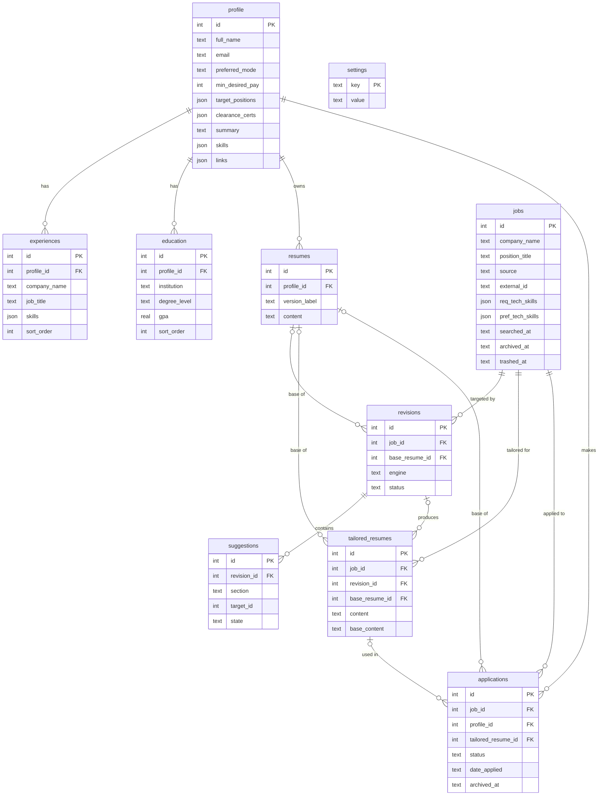

# FistBump Database Schema

SQLite, accessed from Go through `modernc.org/sqlite` (pure Go, no cgo). The authoritative DDL is `backend/internal/db/migrations/001_init.sql`, embedded with `go:embed`. If this file and the SQL disagree, the SQL wins.

## Conventions

- **Foreign keys** are enforced. `db.Open()` enables them in the DSN (off by default in SQLite).
- **Migrations** run at startup in order and track progress with `PRAGMA user_version`.
- **Timestamps** are UTC ISO 8601 text, `YYYY-MM-DDTHH:MM:SSZ`, set by SQLite defaults. Columns named `*_date` hold user-entered dates as text, and the backend validates their format.
- **JSON columns** are `TEXT` holding a JSON array, guarded by `CHECK (json_valid(...))` and defaulting to `'[]'`. Used for values read and written with the row and never queried individually.
- **Enums** are `TEXT` with a `CHECK (... IN (...))` constraint.
- **No secrets.** API keys and tokens never touch the database. See "API keys and secrets" in [architecture.md](architecture.md).
- **Single user.** One `profile` row in practice. Tables reference `profile_id` so multiple profiles need no schema change.

## Relationships

## Delete behavior

| Child | Parent | On parent delete |
|-------|--------|------------------|
| `experiences`, `education`, `resumes` | `profile` | CASCADE |
| `applications` | `profile` | CASCADE |
| `revisions`, `tailored_resumes` | `jobs` | CASCADE |
| `applications` | `jobs` | **RESTRICT**: a job with an application cannot be deleted |
| `suggestions` | `revisions` | CASCADE |
| `revisions`, `tailored_resumes`, `applications` (`base_resume_id`) | `resumes` | SET NULL |
| `tailored_resumes` (`revision_id`) | `revisions` | SET NULL |
| `applications` (`tailored_resume_id`) | `tailored_resumes` | SET NULL |

`applications.job_id` RESTRICT keeps tracked jobs out of garbage collection. GC deletes only jobs with no application.

## Tables

### `profile`

The user's identity and job preferences.

| Column | Type | Notes |
|--------|------|-------|
| `id` | INTEGER PK | Autoincrement |
| `full_name` | TEXT NOT NULL | |
| `email`, `phone`, `home_location` | TEXT | Optional |
| `target_positions` | JSON array | Titles the user is aiming for. Default `[]` |
| `preferred_mode` | TEXT | `Remote`, `Hybrid`, `On-site`, `Any`, or NULL |
| `min_desired_pay` | INTEGER | Optional minimum pay |
| `clearance_certs` | JSON array | Clearances and certifications. Default `[]` |
| `summary` | TEXT | Professional summary shown at the top of the resume. |
| `skills` | JSON array | General skills not tied to one role, for example a resume's skills list. Counted in matching. Default `[]` |
| `links` | JSON array | Contact links as the user wrote them (for example `linkedin.com/in/you`). Kept from imports, printed on the contact line, never generated. Default `[]` |
| `created_at`, `updated_at` | TEXT | Defaults to now. `updated_at` is maintained by the store layer |

### `experiences`

Work history entries. Together with `education` and `profile`, these form the master resume.

| Column | Type | Notes |
|--------|------|-------|
| `id` | INTEGER PK | |
| `profile_id` | INTEGER NOT NULL | FK to `profile`, CASCADE |
| `company_name`, `job_title` | TEXT NOT NULL | |
| `start_date`, `end_date` | TEXT | A NULL `end_date` means the role is current |
| `location` | TEXT | |
| `description` | TEXT | Responsibilities |
| `impact` | TEXT | Quantified results |
| `skills` | JSON array | Skills used in this role. This is the source for skill-gap matching. Default `[]` |
| `sort_order` | INTEGER NOT NULL | Display order, default 0 |

### `education`

| Column | Type | Notes |
|--------|------|-------|
| `id` | INTEGER PK | |
| `profile_id` | INTEGER NOT NULL | FK to `profile`, CASCADE |
| `institution` | TEXT NOT NULL | |
| `degree_level` | TEXT | For example BS, MS |
| `discipline` | TEXT | Field of study |
| `graduation_date` | TEXT | |
| `gpa` | REAL | |
| `honors`, `details` | TEXT | |
| `sort_order` | INTEGER NOT NULL | Default 0 |

### `resumes`

Saved resume documents used as a base for tailoring. Structured master data lives in `profile`, `experiences`, and `education`. This table holds rendered or imported resume text.

| Column | Type | Notes |
|--------|------|-------|
| `id` | INTEGER PK | |
| `profile_id` | INTEGER NOT NULL | FK to `profile`, CASCADE |
| `version_label` | TEXT NOT NULL | User-facing name |
| `target_position` | TEXT | Optional |
| `content` | TEXT NOT NULL | Full resume text |
| `created_at`, `updated_at` | TEXT | |

### `jobs`

A job posting, pasted, entered by hand, or imported through a connector.

| Column | Type | Notes |
|--------|------|-------|
| `id` | INTEGER PK | |
| `company_name`, `position_title` | TEXT NOT NULL | |
| `listing_url` | TEXT | |
| `source` | TEXT NOT NULL | `pasted` (default), `manual`, or `greenhouse` |
| `external_id` | TEXT | The connector's id for the posting. NULL for pasted and manual jobs |
| `work_mode`, `employment_type`, `location` | TEXT | Free text |
| `pay_min`, `pay_max` | INTEGER | |
| `description` | TEXT | Cleaned text |
| `raw_text` | TEXT | Original input as received |
| `req_tech_skills`, `pref_tech_skills` | JSON array | Required and preferred technical skills |
| `req_soft_skills`, `pref_soft_skills` | JSON array | Required and preferred soft skills |
| `requirements` | JSON array | Requirement statements pulled from the posting |
| `close_date` | TEXT | Application deadline, if known |
| `created_at` | TEXT | First import |
| `searched_at` | TEXT | Refreshed on every re-import. Drives garbage collection |
| `archived_at` | TEXT | When the user archived the job, or NULL. Archive means keep but hide: archived jobs are hidden from lists and pickers, keep their revisions, drafts and applications, and are never removed by garbage collection |
| `trashed_at` | TEXT | When the user moved the job to the Trash, or NULL. Trashed jobs are hidden and can be restored until garbage collection deletes them, `jobs.trash_days` after this time. A job with an application cannot be trashed |

Indexes:
- `idx_jobs_source_external`: unique on `(source, external_id)` where `external_id IS NOT NULL`. A re-imported connector posting updates the existing row instead of duplicating it.
- `idx_jobs_searched_at`: supports the GC query.
- `idx_jobs_archived`: on `archived_at`, for the active and archived lists.

### `revisions`

One suggestion-generating pass for a job.

| Column | Type | Notes |
|--------|------|-------|
| `id` | INTEGER PK | |
| `job_id` | INTEGER NOT NULL | FK to `jobs`, CASCADE |
| `base_resume_id` | INTEGER | FK to `resumes`, SET NULL |
| `engine` | TEXT NOT NULL | `local`, `remote`, or `rules` (the engine that actually ran) |
| `status` | TEXT NOT NULL | `queued` (default), `running`, `done`, `failed`, `canceled` |
| `error` | TEXT | Set when `failed` |
| `created_at`, `completed_at` | TEXT | `completed_at` is NULL until finished |

### `suggestions`

One proposed change inside a revision.

| Column | Type | Notes |
|--------|------|-------|
| `id` | INTEGER PK | |
| `revision_id` | INTEGER NOT NULL | FK to `revisions`, CASCADE |
| `section` | TEXT NOT NULL | `summary`, `experience`, `education`, or `skills` |
| `target_id` | INTEGER | Row id within that section, for example an `experiences.id`. NULL for `summary` and `skills`. Not a declared FK because it points at different tables |
| `original_text` | TEXT NOT NULL | Text before the change |
| `proposed_text` | TEXT NOT NULL | What the engine proposed |
| `state` | TEXT NOT NULL | `pending` (default), `accepted`, `rejected`, `edited` |
| `edited_text` | TEXT | The user's version when `state = 'edited'` |

Index: `idx_suggestions_revision` on `revision_id`.

Final text for a suggestion: `edited_text` if edited, `proposed_text` if accepted, `original_text` if rejected. Pending suggestions block creation of a tailored resume.

### `tailored_resumes`

The reviewed output of a revision.

| Column | Type | Notes |
|--------|------|-------|
| `id` | INTEGER PK | |
| `job_id` | INTEGER NOT NULL | FK to `jobs`, CASCADE |
| `revision_id` | INTEGER | FK to `revisions`, SET NULL |
| `base_resume_id` | INTEGER | FK to `resumes`, SET NULL |
| `content` | TEXT NOT NULL | Final resume text with decisions applied |
| `base_content` | TEXT | The resume text the revision started from, saved when the tailored resume is built, so the diff view compares against the exact original |
| `created_at` | TEXT | |

Content is stored in full, so deleting the revision or base resume does not affect it.

### `applications`

The tracker table.

| Column | Type | Notes |
|--------|------|-------|
| `id` | INTEGER PK | |
| `job_id` | INTEGER NOT NULL | FK to `jobs`, **RESTRICT** |
| `profile_id` | INTEGER NOT NULL | FK to `profile`, CASCADE |
| `base_resume_id` | INTEGER | FK to `resumes`, SET NULL |
| `tailored_resume_id` | INTEGER | FK to `tailored_resumes`, SET NULL |
| `status` | TEXT NOT NULL | Pipeline stage: `Saved` (default), `Applied`, `Interviewing`, `Offered`, `Rejected` |
| `date_applied`, `next_step_date` | TEXT | |
| `exported_pdf_path` | TEXT | Where the user last saved the exported PDF |
| `notes` | TEXT | |
| `archived_at` | TEXT | When the user archived the application, or NULL. Archiving does not change `status`, so a restored application returns to its stage |
| `created_at`, `updated_at` | TEXT | |

Indexes: `idx_applications_status`, and `idx_applications_job`, which is unique so a job has at most one application.

### `settings`

Key-value store for non-secret preferences. `store/settings.go` returns defaults for missing keys, and `001_init.sql` seeds these with `INSERT OR IGNORE`.

| Key | Default | Meaning |
|-----|---------|---------|
| `ai.mode` | `auto` | Provider selection: auto, local, remote, or rules |
| `ai.selected_model` | empty | Catalog id of the chosen local model |
| `ai.idle_minutes` | `5` | Minutes of inactivity before `llama-server` is stopped. Minimum 1 |
| `jobs.retention_days` | `30` | Jobs not seen for this long are eligible for GC. Minimum 1, since 0 would make every untracked job eligible |
| `jobs.trash_days` | `7` | Days a trashed job can be restored before GC deletes it. Minimum 1 |
| `ai.remote.base_url` | empty | Remote engine endpoint. Not seeded by `001_init.sql`. The store returns this default when the row is absent |
| `ai.remote.model` | empty | Remote model name. Not seeded. Same default behavior |
| `connectors.greenhouse.boards` | `[]` | JSON array of custom Greenhouse board tokens |
| `connectors.greenhouse.categories` | `[]` | JSON array of curated category ids for the industries the user is open to (`[]` means all). Pre-selected as the industry filter in job search; the backend does not apply it on its own. Not seeded by `001_init.sql`. The store returns this default when the row is absent |

All values are stored as text, so booleans are `'true'` and `'false'` and arrays are JSON strings.

The UI theme and window state are not in this table. Electron keeps them in `userData/prefs.json`, because they apply before the window opens and before the backend starts.

## Garbage collection

`store/gc.go` removes jobs that no row in `applications` references and that are either:

- in the Trash, with `trashed_at` older than `jobs.trash_days`, or
- neither archived nor trashed, with `searched_at` older than `jobs.retention_days`.

Archived jobs are never collected. Cascades then remove the job's revisions, suggestions, and tailored resumes. `idx_jobs_searched_at` keeps the scan cheap, and the storage cleanup route runs the same logic on demand.

## Mapping to the proposal

| Proposal entity | Tables |
|-----------------|--------|
| Master_Resumes | `profile`, `experiences`, `education`, `resumes` |
| Job_Postings | `jobs` |
| Tailored_Resumes | `revisions`, `suggestions`, `tailored_resumes` |
| Application_Pipeline | `applications` |
